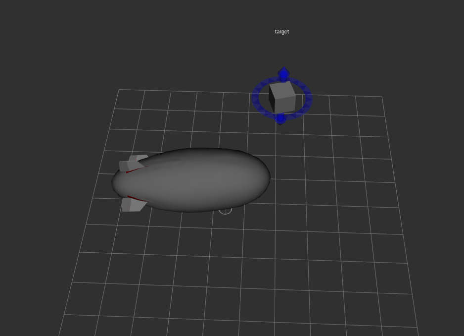
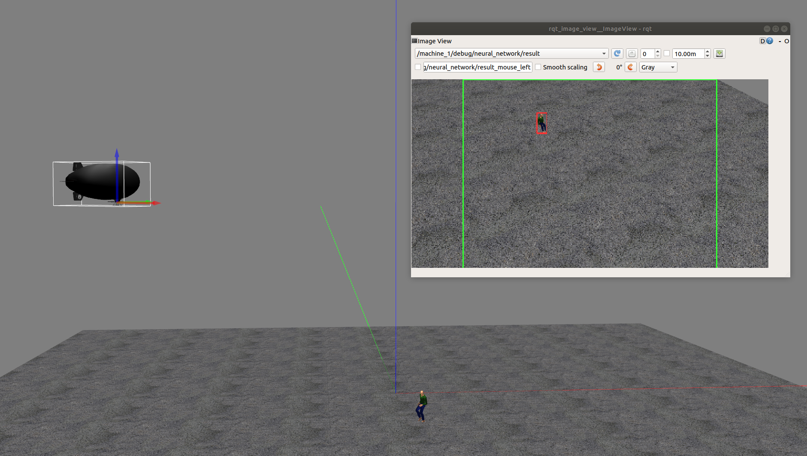

Blimp Robot Description File 
=================================================================

# Copyright and License

All Code in this repository - unless otherwise stated in local license or code headers is

Copyright 2020 Max Planck Institute for Intelligent Systems

Licensed under the terms of the GNU General Public Licence (GPL) v3 or higher.
See: https://www.gnu.org/licenses/gpl-3.0.en.html


# Contents
ROS packages:

* /blimp_description -- including blimp xml files that described the robot and supports Gazebo/ROS styled simulation. 
* /blimp_gazebo_plugin -- some gazebo plugins

# Compiling
Link or copy all flight and optional packages required into the *src* folder of your catkin workspace.

Build packages with **catkin_make**

# Requirements
* [ROS] (http://wiki.ros.org/melodic) 
* [mav_msgs] (http://wiki.ros.org/mav_msgs)
* [Gazebo] (http://gazebosim.org/) -- tested with Gazebo 9.0
* [rotors_simulator] (https://github.com/ethz-asl/rotors_simulator)
* [BebopS] (https://github.com/gsilano/BebopS)

# Additional Requirements
* [aircap] (https://github.com/robot-perception-group/AIRCAP)

Installation Instructions - Ubuntu 18.04 with ROS Melodic and Gazebo 9
---------------------------------------------------------------------------

1. Install and initialize ROS Melodic desktop full, additional ROS packages, catkin-tools, and wstool:

```console
$ sudo sh -c 'echo "deb http://packages.ros.org/ros/ubuntu $(lsb_release -sc) main" > /etc/apt/sources.list.d/ros-latest.list'
$ sudo apt-key adv --keyserver 'hkp://keyserver.ubuntu.com:80' --recv-key C1CF6E31E6BADE8868B172B4F42ED6FBAB17C654
$ sudo apt update
$ sudo apt install ros-melodic-desktop-full ros-melodic-joy ros-melodic-octomap-ros ros-melodic-mavlink
$ sudo apt install python-wstool python-catkin-tools protobuf-compiler libgoogle-glog-dev ros-melodic-control-toolbox
$ sudo rosdep init
$ rosdep update
$ echo "source /opt/ros/melodic/setup.bash" >> ~/.bashrc
$ source ~/.bashrc
$ sudo apt install python-rosinstall python-rosinstall-generator build-essential
```
2. If you don't have ROS workspace yet you can do so by

```console
$ mkdir -p ~/catkin_ws/src
$ cd ~/catkin_ws/src
$ catkin_init_workspace  # initialize your catkin workspace
$ cd ~/catkin_ws/
$ catkin init
$ cd ~/catkin_ws/src
$ git clone -b med18_gazebo9 https://github.com/gsilano/rotors_simulator.git
$ git clone -b med18_gazebo9 https://github.com/gsilano/mav_comm.git
$ git clone -b dev/gazebo9 https://github.com/gsilano/BebopS.git
$ git clone git clone https://github.com/ros-teleop/teleop_twist_keyboard
$ git clone https://github.com/ootang2018/blimp_description.git
$ cd ~/catkin_ws
```

and optionally
```console
$ git clone https://github.com/ootang2018/AirCap.git

```
you might need to look into github page (https://github.com/ootang2018/AirCap.git) for more installation instruction

3. Build your workspace with `python_catkin_tools` (therefore you need `python_catkin_tools`)

```console
$ rosdep install --from-paths src -i
$ catkin_make
$ source devel/setup.bash
```

4. Add sourcing to your `.bashrc` file

```console
$ echo "source ~/catkin_ws/devel/setup.bash" >> ~/.bashrc
$ source ~/.bashrc
```

5. Update the pre-installed Gazebo version. This fix the issue with the `error in REST request for accessing api.ignition.org`

```console
$ sudo sh -c 'echo "deb http://packages.osrfoundation.org/gazebo/ubuntu-stable `lsb_release -cs` main" > /etc/apt/sources.list.d/gazebo-stable.list'
$ wget http://packages.osrfoundation.org/gazebo.key -O - | sudo apt-key add -
$ sudo apt update
$ sudo apt install gazebo9 gazebo9-* ros-melodic-gazebo-*
$ sudo apt upgrade
```

Basic Usage
----------------------------------------------------------
After installing, you can test with the following commands in a terminal

```console
$ roslaunch blimp_description blimp_with_env.launch  
$ roslaunch blimp_description teleokeyboard.launch 
```
You should see blimp in gazebo environment and be able to fly it via teleokeyboard

To fly with blimp, it is necessary to generate thrust with the rotors, this is achieved by sending commands as follows:

 ```console
$ rostopic pub /blimp/command/motor_speed mav_msgs/Actuators '{angular_velocities: [100, 100, 0]}'
```

To speed up the simulation, a certain set of parameters can be included by varying the flags: 
`enable_meshes` (it enables the mesh of the blimp), `enable_sensors` (it enables the ground truth sensor), `enable_wind_plugin` (external disturbances will be simulated)

These value can be modified before simulating the blimp behavior acting on the launch file:

```console
$ roslaunch blimp_description blimp_with_env.launch enable_meshes:=false
```

Sometimes it is useful to manually set destination or autogenerated destination. The interactive target allows user to specify destinations by draging target in `rviz`

```console
$ roslaunch blimp_description spawn_target
$ rviz
``` 



Finally, if AirCap is installed:
```console
$ cd aircap/script/simulation
$ bash setup_mavocap_gazebo.sh 
```
This will setup blimp with AirCap. Now you should be able to see blimp in Gazebo. You can run `rqt_image_view` in a new console and choose image topic of interest. If a human actor is passed by, a bounding box generated by neural network detector should appear


